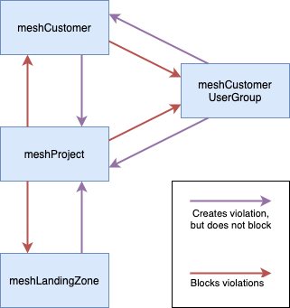

## Introduction: what are meshPolicies?

A meshPolicy is a set of rule(s) between two [meshObjects](meshcloud.index.md#introduction) that are globally defined by your organization. Each rule describes what [tag](meshcloud.tag-schema.md) values have to be present on both meshObjects, in order to comply with the meshPolicy. meshPolicies are enforced in various places when attaching meshObjects.
  
### When am I impacted by meshPolicies?

> If your organization has no policies defined at all, the information below is not relevant.

Note that it depends if your organization uses policies and on which meshObjects they are applied. We will discuss all possible places here.
You may encounter policies in the meshPanel when doing any of the following actions:

1. Creating a new project
    1. When adding a meshPlatform with a meshLandingZone to a new project, all policies are evaluated between a 'meshProject' and a 'meshLandingZone'
    2. Upon saving a new project, all policies between 'meshCustomer' and 'meshProject' are evaluated.
2. Editing a project
    1. When adding a new location with a meshLandingZone all policies are evaluated between the 'meshProject' and the selected 'meshLandingZone'.
    2. When adding a new meshCustomerUserGroup to a meshProject, all policies are evaluated between the 'meshProject' and the 'meshCustomerUserGroup'.
    3. When changing a tag value (e.g. changing the environment) of a project, **all** policies related to the meshProject are evaluated as it impacts many meshObjects. The following meshObjects will be evaluated on to the project:
        - the meshCustomer the project lives in
        - all assigned meshLandingZones
        - all assigned meshUsers
        - all attached meshCustomerUserGroups
3. Adding a meshCustomerUserGroup to a meshCustomer. All policies between 'meshCustomer' and 'meshCustomerUserGroup' are evaluated on the given 'meshCustomer' and 'meshCustomerUserGroup'.

### What happens when I violate a meshPolicy?

It might happen, consciously or unconsciously, that you violate one or more policies. At every place in the meshPanel that is mentioned above this section, we prevent you from finalizing the violation and you will be prompted with an error message explaining which meshPolicy or policies you violated, and why.

Take this policy violation as an example (see the picture below), where we have a meshPolicy defined on 'meshCustomer' and 'meshProject', both on the `environment` tag.

The project that is being created called 'my-example-project-prod' wants environment `prod` and the meshCustomer 'managed-customer' the project is being created in, has environments `dev`, `test` and `qa` defined. This means there is a mismatch as `<prod>` is not inside `<dev, test, qa>`. In order to solve this problem, we have to pick an environment that is defined on the meshCustomer, e.g. `dev`. After picking a valid environment value, we can save the project again, and (if we don't violate any further policies) the project is successfully created, including the right compliance for your organization! ✅

### Are there any other places where policies are enforced?

Besides end-users being impacted at the places above, there are also other places where policy violations could be caused. The diagram below describes all possible relationships between meshObjects and the behavior that is expected, depending on the direction of the change.

The purple arrows describe an action done by administrators, and red arrows describe an action done by end-users (e.g. Customer Admins), which is what was discussed above this section.

The purple arrows indicate a 'soft' violation, meaning that the change will actually be accepted. These soft violations are only able to happen by administrators' changes, meaning the cloud foundation team of your organization. For example, if a member of the cloud foundation team decides to move a meshLandingZone from `dev` environment to `prod` environment, all projects attached to that meshLandingZone might end up in a 'non-compliant state' because of the violations that could occur. Partners and Customer Admins will be able to see what violation(s) are currently active on a per-customer basis and can attempt to resolve the violation(s).

### What are some examples?

> Note: the information below might be more relevant for administrators, but nevertheless it should give you a rough idea on how policies could be implemented.

Your organization is fully free to define policies across the entire meshStack. A few common use cases are:

1) Enforcing that a meshProject is used for an environment that is also defined on its meshCustomer.

    Imagine a meshCustomer with `environment=[sandbox, test]`. If there is a meshPolicy in place between meshCustomers and meshProjects on the environment tag, users cannot create new meshProjects that use an environment that is **not** available on the meshCustomer, for example `environment=[prod]`.

2) Enforcing that a meshProject only has meshCustomerUserGroups that are allowed access to highly confidential projects.

3) Enforcing that a meshProject only has meshLandingZones assigned to it that are meant for the environment of the meshProject.

4) Enforcing that a meshProject only has meshLandingZones assigned to it that are meant for the given business unit of the meshProject.
