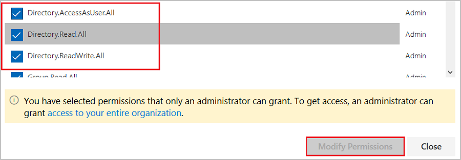

In Azure, a [Landing Zone](./meshcloud.landing-zones.md) is defined via a management group the subscription for the project will be assigned to. Policies can be applied
to these management groups. Optionally a blueprint can also be defined. Via an Azure Blueprint default resources can be deployed to the
subscription and additional specific policies can be defined. A blueprint can be configured to decline users to change or delete the
resources and policies created by the blueprint.

The landingzone can be configured in the `Administration` section. If a project is selected to have an Azure location a landingzone must be picked by the user. By choosing a landing zone platform specific configuration can be set (in this case for Azure). The options for Azure are:

## Management Group

All newly created meshProjects get their corresponding Subscription assigned to this [Management Group](https://azure.microsoft.com/en-us/features/management-groups/). The Management Group can be configured by an platform operator throughout the Azure portal.

## Blueprint Name

The name of the [Blueprint](https://docs.microsoft.com/en-us/azure/governance/blueprints/overview) which should get assigned to the project. You can leave it empty, then no Blueprint will get automatically assigned.

## Blueprint Management Group

Blueprints must reside inside a Management Group. It is assumed it is in the same group as the group where to put the Subscriptions by default. If the Blueprint is located in another group it can be configuered here.

Operators must ensure to create these management groups in the meshcloud AAD Tenant before configuring them
for use in a Landing Zone.

## Max. Auto Upgrade Blueprint Version

Blueprints are versioned in Azure and can be managed via the Azure Portal. To avoid the accidental assignment of new (and possibly faulty) Blueprints there is this `Max. Auto Upgrade Blueprint Version` field. If you enter a version identifier here which corresponds to a existing Blueprint version in the Azure portal:

* Existing projects with this Landing Zone will get their Blueprint updated to this version on the next replication
* Newly created projects will get the latest Blueprint version assigned (possibly higher then the version configured here)

## Configuring Blueprint Automation

In order to assign [Blueprints](https://docs.microsoft.com/en-us/azure/governance/blueprints/overview) the meshcloud Azure replicator needs to be configured with the service principal id of the `Azure Blueprints` app
provided by Microsoft.

### Finding the Azure Blueprints App Id

The `Azure Blueprints` service principal id is different in every AAD Tenant, so we need to find the id
of the app in the meshcloud AAD Tenant.

The easiest way to accomplish this is to start an Azure cloud shell in a subscription on the meshcloud AAD Tenant and execute the following command:

```powershell
PS Azure:\> Get-AzureRmADServicePrincipal -ApplicationId f71766dc-90d9-4b7d-bd9d-4499c4331c3f
```

The response should be similar to

```powershell
ServicePrincipalNames : {f71766dc-90d9-4b7d-bd9d-4499c4331c3f}
ApplicationId         : f71766dc-90d9-4b7d-bd9d-4499c4331c3f
ObjectType            : ServicePrincipal
DisplayName           : Azure Blueprints
Id                    : 227ac22a-************
```

Write down the ID (in this case `227ac22a-*`) as this is the `AZURE_BLUEPRINT_PRINCIPAL`.

If this call **does not** return a usable ID then you can try an alternative way and find this principal via the [Graph Explorer](https://developer.microsoft.com/en-us/graph/graph-explorer):

<!-- markdownlint-disable MD029 -->

1. Open [https://developer.microsoft.com/en-us/graph/graph-explorer](https://developer.microsoft.com/en-us/graph/graph-explorer)
2. Login with a Global Admin user from the directory in which you want to check for the `AZURE_BLUEPRINT_PRINCIPAL`
3. You need sufficient permissions to read the principal. Select modify permissions to get the permissions


4. Enable the `Directory.AccessAsUser.All`, `Directory.Read.All`, `Directory.ReadWrite.All` rights and give your admin consent



1. List your Blueprint Service Principal ID via `https://graph.microsoft.com/beta/<AAD_TENANT_ID>/servicePrincipals?$filter=appId eq 'f71766dc-90d9-4b7d-bd9d-4499c4331c3f'`. Replace the `<AAD_TENANT_ID>` with the Directory ID of your AAD (can be found in the properties screen of the AAD in [https://portal.azure.com](https://portal.azure.com))
2. Remember to delete the Graph Explorer App access afterwards from your **Enterprise applications** section of your Active Directory in the Azure portal

<!-- markdownlint-enable MD029 -->

The response should look like this:

```json

{
    "@odata.context": "https://graph.microsoft.com/beta/$metadata#servicePrincipals",
    "value": [
        {
            "id": "227ac22a-************",
            "deletedDateTime": null,
            "accountEnabled": true,
            "appDisplayName": "Azure Blueprints",
            "appId": "f71766dc-90d9-4b7d-bd9d-4499c4331c3f",
            "applicationTemplateId": null,
            "appOwnerOrganizationId": "f8cdef31-a31e-4b4a-93e4-5f571e91255a",
            "appRoleAssignmentRequired": false,
            "displayName": "Azure Blueprints",
            "errorUrl": null,
            "homepage": null,
            "loginUrl": null,
            "logoutUrl": null,
            "notificationEmailAddresses": [],
            "preferredSingleSignOnMode": null,
            "preferredTokenSigningKeyEndDateTime": null,
            "preferredTokenSigningKeyThumbprint": null,
            "publisherName": "Microsoft Services",
            "replyUrls": [],
            "samlMetadataUrl": null,
            "samlSingleSignOnSettings": null,
            "servicePrincipalNames": [
                "f71766dc-90d9-4b7d-bd9d-4499c4331c3f"
            ],
            "signInAudience": "AzureADMultipleOrgs",
            "tags": [],
            "addIns": [],
            "api": {
                "resourceSpecificApplicationPermissions": []
            },
            "appRoles": [],
            "info": {
                "termsOfServiceUrl": null,
                "supportUrl": null,
                "privacyStatementUrl": null,
                "marketingUrl": null,
                "logoUrl": null
            },
            "keyCredentials": [],
            "publishedPermissionScopes": [],
            "passwordCredentials": []
        }
    ]
}
```

Write down the ID (in this case `227ac22a-*`) as this is the `AZURE_BLUEPRINT_PRINCIPAL`.

> In case your admin user can not grant the Graph Explorer the admin access rights he needs to query the AAD, try to create a new user via the Azure Portal in the AAD and grant this temporary user `Global Admin`rights. Try to use this user for login with the Graph Explorer. After you did your query you can delete this user again.

### Authorize the meshcloud Service Principal

You must must grant the meshcloud Service Principal `owner` access to all [management groups](https://docs.microsoft.com/en-us/azure/governance/management-groups/) in the meshcloud AAD Tenant.

Before you can grant this access, you must have access to the root Management Group yourself. If you haven't already done so, please make sure your user is a `Global Administrator` on the meshcloud AAD Tenant
and has [elevated access to all management groups](https://docs.microsoft.com/en-us/azure/role-based-access-control/elevate-access-global-admin).

> In case you're not able to see all management groups after elevating access, try signing out and back in to Azure Portal.

Once you have elevated access, use the Azure Portal to Navigate to the "Management Groups"  blade, then click on the "Details" link of the Tenant Root Group. Select "Access Control (IAM)" from the menu and create a Role assignment that grants the [App created above](#meshcloud-service-principal) for the meshcloud Service Principal (i.e. `meshReplicator`) the `Owner` permission on this resource.

In this screen you can also find the Object ID and Application ID of your service principal. In case you prefer the CLI and have the Azure CLI installed the following Powershell command can also reveal this ID for you:

```powershell
Get-AzADServicePrincipal | Where-Object {$_.Displayname -eq "<NAME_OF_THE_SERVICE_ACCOUNT>"}
```
