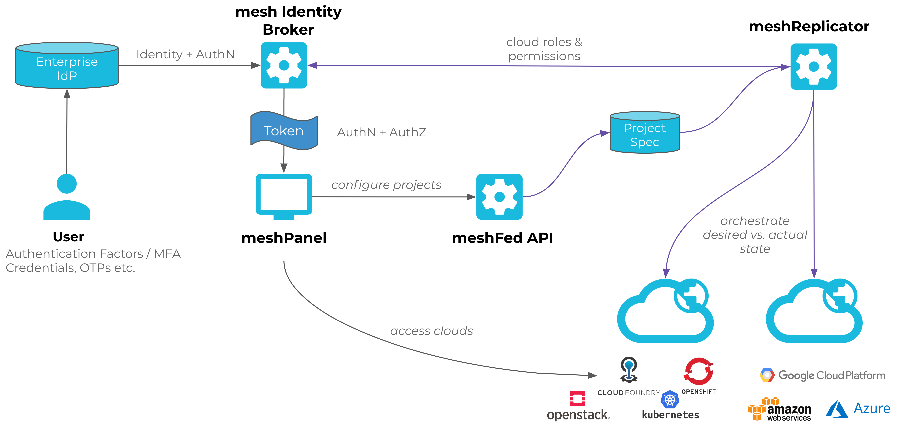

One of meshStacks main features is to provide single identities across multiple cloud and container platforms. Therefore, meshStack contains a full-featured **Identity Broker** (meshIdB) which consumes identities from company directories and adds authorization information for the specific cloud platforms.

Identity Federation enables enterprises to integrate corporate SSO systems at a single point (the **mesh Identity Broker**). meshStack then automatically ensures identity and authorization federation into all connected **Platform Instances** as depicted below by issuing tailored tokens for the meshProject in focus.

## Supported Technologies

The main supported technologies for Identity Federation with meshStack are

- LDAP
- Open ID Connect
- SAML
- Azure AD

meshStack supports the simultaneous integration of multiple [Enterprise Identity Providers (IdPs)](https://en.wikipedia.org/wiki/Identity_provider) at the Identity Broker. This allows operators to combine identities from different sources in the platform and unify management of multi-cloud access in meshStack.

## Requirements and Limitations

Integrators must be aware of the following requirements and limitations for IdPs which serve as identity sources for meshStack.

- IdP must provide
  - a stable and immutable user identifier (e.g. an OIDC `sub` claim)
  - a human-readable, unique username*
  - an email address
- IdP should provide name (first name, given name) information to improve user experience

> \* Please note that meshStack currently only offers limited support for propagation of changed usernames from IdPs.

## Concerns for High Availability

Identity Federation is designed for high-availability when the meshIdB is deployed in a redundant data-center HA setup. A potential loss of meshFed availability as the multi-cloud "control plane" is tolerable for the system. When configured correctly, users are still able to log in directly at cloud platform instances with the meshIdB and its optional upstream IdPs. Workload uptimes are never affected by outages of meshStack.

Please consult the platform-specific documentation for the required configuration.
