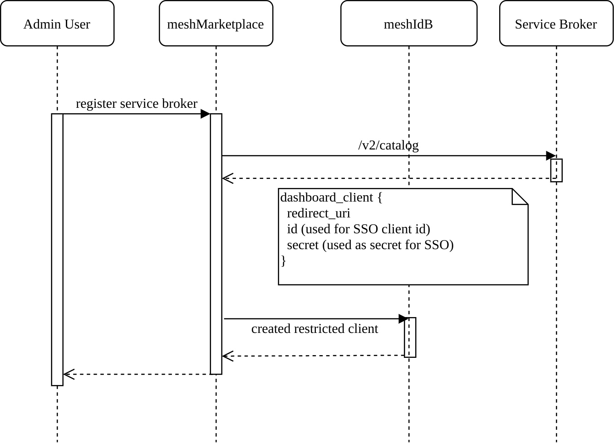
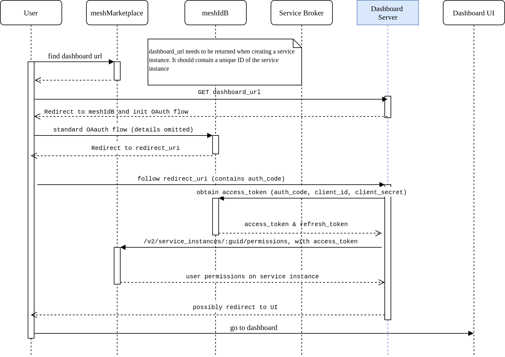

Service Brokers can offer dashboards for their service instances. Users can use the dashboard to interact with the service, e.g. for monitoring and service configuration. Since only the Marketplace knows which users may have access to a specific service instance, Service Broker Dashboards must integrate with the Marketplace’s SSO provider (meshIdB).

## Overview of the SSO Flow

This section describes the OAuth code flow, that must be used by the Service Broker to provide a Dashboard integrated with meshStack Single-Sign-On (SSO).

### 1. Create restricted client in meshIdB for Service Broker

The platform (meshMarketplace) retrieves the desired SSO OAuth client information from the Service Broker when retrieving the service catalog (see figure below). The meshMarketplace then proceeds with creating the client in meshIdB, if it doesn’t exist yet.

Service Brokers should be aware that there’s only a single, global namespace for dashboard client ids. It is recommended that Services use a client id  prefixed with a DNS name or other suitable identifier to ensure global uniqueness.

### 2. The OAuth flow + Authorization

When the user accesses the dashboard, the dashboard has to follow the auth flow as follows:

Service Brokers need to discover the URLs for initiating the OAuth flow and for retrieving the permissions on the service instance from meshMarketplace.
